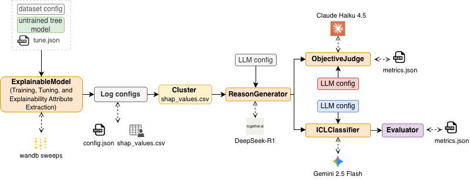

<div align="center">
<h1>XAI-Guided-CoT</h1>
<a href="tutorial.ipynb" style="text-decoration: none;">📖 Tutorial</a> | <a href="experiments/results.ipynb" style="text-decoration: none;">📊 Results</a>
</div>

## Aim

To orchestrate an end-to-end generate-AI workflow (or pipeline) for automating the Chain-of-Thought (CoT) prompting for tabular binary classification by generating intermediate reasoning from global and local feature importances. 

<div align="center">
  
</div>

<b><u>Note:</u></b> The XAI attributes are obtained by training and tuning a tree-based explainable model and then extracting its feature importances (using sklearn's `feature_importances_` attribute) and SHAP values (using `TreeExplainer`)

## Environment Setup

- Clone this repository.

    ```bash
    git clone https://github.com/Gaurav0502/xai-guided-cot.git
    ```

- Create a virtual environment to isolate all the dependencies from any global dependencies on your local system.

    ```bash
    python3 -m venv venv
    ```

- Activate the virtual environment.

    ```bash
    source venv/bin/activate # MacOS

    venv\Scripts\activate # Windows
    ```

- Install all packages in the `requirements.txt` file.

    ```bash
    pip3 install -r requirements.txt
    ```

- You may have to install `toon_format` from `toon-python` separately. (though it's also included in `requirements.txt`)

    ```bash
    pip3 install git+https://github.com/toon-format/toon-python.git
    ```

- Run the `setup.sh` to ensure the required directory structure is created.

    ```bash
    chmod +x setup.sh
    ./setup.sh
    ```

- After setting up the dependencies, install the google cloud SDK and authenticate your environment to access Google Cloud Storage (GCS) and Vertex AI.

    ```bash
    gcloud auth application-default login
    ```

- Get API keys from Together AI (`TOGETHER_API_KEY`) and Anthropic Developer Platform (`CLAUDE_API_KEY`). Add them into the `.env` file created by `setup.sh`.

- You may require a `WANDB_API_KEY` and `WANDB_PROJECT_NAME` since the tree-based `ExplanableModel` is trained and tuned using `wandb sweep`.

- Now, you must setup Google Cloud Provider (GCP) with the following steps:
    1. Create a Project in GCP and record the `PROJECT_ID`.
    2. Ensure you enable Billing on the required APIs (Vertex AI and Google Cloud Storage).
    3. Inside the Project, create GCP Bucket to store the batch inference job JSONL files (inputs and outputs) for Vertex AI.
    4. Record your `BUCKET_NAME`, `LOCATION`. 
    5. Ensure that the `LOCATION` you choose has the model you want to use because the code in this repository requires the `LOCATION` for both GCP Bucket and Vertex AI Batch Inference to be same.

- Finally, your `.env` file must look as follows:

    ```bash
    # wandb config
    WANDB_API_KEY=<YOUR-API-KEY>
    WANDB_PROJECT_NAME=<YOUR-WANDB-PROJECT-NAME>

    # gcp config
    PROJECT_ID=<YOUR-PROJECT-ID>
    BUCKET_NAME=<YOUR-GCP-BUCKET-NAME>
    LOCATION=<YOUR-LOCATION> # same for storage and batch inference

    # together ai config
    TOGETHER_API_KEY=<YOUR-TOGETHERAI-API-KEY>

    # anthropic config
    CLAUDE_API_KEY=<YOUR-CLAUDE-API-KEY>
    ```

<b><u>Notes:</u></b>

1. Only the API keys are secrets. Others are just kept inside the `.env` since they define the environment for different SDKs.

2. If you setup `WANDB_API_KEY` from the CLI, you can ignore that variable. However, the `WANDB_PROJECT_NAME` is required.


- If you wish to check if your environment setup is complete, you can run the unit tests inside `test/` using `pytest`.

    ```bash
    pytest -v
    ```
<b><u>Notes:</u></b>
1. All tests are expected to be successful if the environment is correctly configured.
2. There is a unit test for overall pipeline execution (`tests/test_pipeline.py`) which hits the real APIs with a small dataset. Therefore, you will be billed for those tests.

## Using the Pipeline

- The repository has a `tutorial.ipynb` file that explains the environment setup procedure in much more detail. 

- It also explains how to use the overall pipeline and its individual components. If you want to run the pipeline on a new dataset, then you can follow this notebook.

## Running the experiments

- We tested the pipeline functionality and prediction performance on four datasets and attempted to answer three research questions:

    1. Can large language models (LLMs) effectively generate natural language reasoning from numerical XAI attributes? (RQ1)

    2. Does providing this natural language reasoning help improve the performance of standard prompt engineering techniques on the tabular binary classification? (RQ2)

    3. How does XAI-Guided-CoT perform in comparison to the tree-based explainable model? (RQ3)

- Additionally, we also attempted to perform two ablation studies to further diagnose the improvement in prediction performance:

    1. Does the improvement of XAI-Guided-CoT over the zero shot baseline happen to be because of CoT alone? (AB-1)
    
    2. Does the semantic context provided by dataset metadata (dataset name, column name, and class names) drive the performance or is it the XAI attributes? (AB-2)

- To run these experiments, you can use the `main.py` file in the root of this repository. Preferably, use it inside the terminal because batch inference jobs can take significant amount of time to complete.

    ```bash
    python3 main.py --dataset <dataset-name> # without masking dataset metadata

    python3 main.py --dataset <dataset-name> --masked # with masking dataset metadata
    ```

    <b><u>Note:</u></b> The dataset name can be one among this list: `titanic`, `loan`, `diabetes`, and `mushroom`. Any other dataset name will raise a `ValueError`.

- The `experiments/` contains a `metrics.json`,  `results.ipynb`, and `stat_sig.py`. The `metrics.json` file has the classification metrics for our experiments along with the objective judge evaluation. The `results.ipynb` file discusses our results through tabulations and visualizations. Moreover, the `stat_sig.py` file performs McNemar test for statistical significance between the difference in performance of two models.

- All the batch inference jobs were executed through the terminal since they might take a lot of time to run. A notebook kernel is not the ideal choice for it.

<b><u>Note:</u></b>

All experimental setup is mentioned inside `experiments/results.ipynb`. However, even with a proper seed value, it is very difficult for the LLM to produce the same reasoning. However, the overall trend of the results is reproducible.

## Summary of Findings

- Large language models can effectively generate natural language reasoning from numerical XAI attributes. Moreover, this reasoning is consistent in terms of the numerical values and has an acceptable grammatical structure. (RQ1)

- XAI-Guided-CoT does show promising results in comparison to that of standard prompt engineering techniques but a more exhaustive evaluation can provide more statistical evidence about the lift in performance. (RQ2)

- The knowledge learned from the tree-based explainable model can be transferred to the LLM through natural language reasoning and can make the performance more deterministic compared to the standard LLM behaviour. (RQ3)

- From the results, it is evident that the improvements are not because of CoT alone but are driven by the XAI attributes. Moreover, standard CoT applies generic domain patterns for the prediction while the XAI-Guided-CoT incorporate dataset-specific patterns as well. (AB-1)

- Being text-based models, the standard approaches suffer to perform when the metadata is masked since they lack context. Interestingly, in some cases, the performance is decent but that is an artifact of the binary classification where there are only two possible options leaving less room for misclassifications. (AB-2)

## References

1. https://docs.cloud.google.com/vertex-ai/generative-ai/docs/multimodal/batch-prediction-gemini (Vertex AI Batch Inference)

2. https://docs.together.ai/docs/batch-inference (Together AI Batch Job)

3. https://platform.claude.com/docs/en/build-with-claude/batch-processing (Anthropic API Batch Processing)
